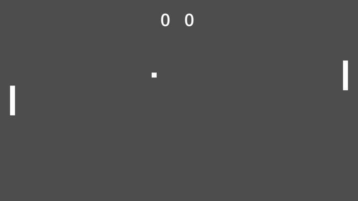

# godot-bend

Write [Godot](https://godotengine.org) games in [Bend 2](https://bend-lang.com),
the language with dependent types, proofs and automatic CPU/GPU parallelism.

```python
import Base
import ../godot/Godot.bend as Godot
import ../godot/api/Node.bend as Node
import ../godot/api/Node2D.bend as Node2D
import ../godot/api/Sprite2D.bend as Sprite2D
import ../godot/api/ResourceLoader.bend as ResourceLoader

def main() -> IO(Unit):
  do IO<Unit>:
    me : Godot.Object <- Godot.self()
    loader : Godot.Object <- ResourceLoader.singleton()
    texture : Godot.Object <- ResourceLoader.load(loader, "res://icon.svg")
    +sprite : Godot.Object <- Sprite2D.new()
    Sprite2D.set_texture(sprite, texture)
    Node.add_child(me, sprite)
    Node2D.set_position(sprite, Godot.Vec2{576.0, 324.0})
```

**Status: early, and working.** A Bend program compiles into a GDExtension
library, Godot loads it, and the program runs frame by frame inside the
engine. Every Godot class has a generated Bend file of typed methods
(14,931 of them, every one that is not virtual but three), over a dynamic core that calls any method by name, as
GDScript's `obj.call(..)` does, and the program hears signals and input.
There is a [Pong](pong/main.bend) written in it. Tested with Godot 4.6.3 on
macOS (arm64) and Linux (arm64 and, in CI, x86_64).

## The typed API

[`godot/api`](godot/api) holds one file per Godot class, 1,023 of them,
generated from the engine's `extension_api.json` by
[`tools/gen_api.py`](tools/gen_api.py). Import the classes you use; Bend
compiles only the defs a program reaches.

- A method is a def that takes the object first:
  `Node2D.set_position(sprite, Godot.Vec2{1.0, 2.0})`,
  `Node.get_name(node) : IO(String)`. Numbers, strings, vectors, colors,
  rects, transforms, quaternions, RIDs, arrays, enums and objects are typed
  (`Godot.Vec2`, `Godot.Transform3D`, `Godot.Rid`, ..). A `Dictionary` and the
  rarer structs (`Vector4`, `Plane`, `AABB`, `Projection`) go as the raw
  `Godot.Variant`, a packed array as a `List<&2, Godot.Variant>`.
- A `Callable` argument is a tag: `Tween.tween_callback(tween, 77)` makes the
  tween's call arrive in `Godot.signals()` as a signal tagged 77.
- Objects are one type, `Godot.Object`, since Bend has no subtyping. So an
  inherited method is called from its own class's file, on any object:
  `Node2D.set_position` takes a `Sprite2D` as it is.
- `Sprite2D.new()` makes one; `Input.singleton()` finds one.
- An enum value is a def: `Node.PROCESS_MODE_ALWAYS()`.
- Arguments with defaults are left to Godot: `Node.add_child(me, node)` takes
  the required ones, `Node.add_child.all(me, node, False{}, 0)` every one.
- A vararg method takes the rest as a list:
  `Object.emit_signal(me, "hit", [Godot.VInt{1}])`.
- A static method takes no object: `Image.create_empty(8, 4, False{}, Image.FORMAT_RGBA8())`.
- [`Global.bend`](godot/api/Global.bend) holds what belongs to no class: the
  global enums (`Global.KEY_W()`) and 96 utility functions
  (`Global.randf_range(0.0, 1.0)`). Bend has its own F32 math, which is pure;
  these are effects, worth it for what only the engine knows.

A wrapper adds the types and nothing else; the call still goes by name
through the dynamic core. What is left out: virtual methods (a program
cannot override one yet) and three with a `Signal` argument. Each file's
header counts its own.

To regenerate, for another Godot version:

```sh
godot --headless --dump-extension-api
tools/gen_api.py extension_api.json godot/api --all
```

## The dynamic core

What the typed files are written in, and what reaches anything they leave
out:

| | |
|---|---|
| `Godot.print(text)` | Godot's `print`: reaches the editor's Output panel |
| `Godot.frame()` | Waits for the next frame; answers the delta in seconds (`F32`) |
| `Godot.self()` | The `BendRuntime` node hosting the program: the way into the scene |
| `Godot.singleton(name)` | `"Input"`, `"ResourceLoader"`, `"Engine"`, .. |
| `Godot.new(class)` | A new object of any class |
| `Godot.call(obj, method, args)` | Any method by name; answers a `Variant` |
| `Godot.get(obj, property)` / `Godot.set(obj, property, value)` | Properties |
| `Godot.node(from, path)` | A node by path, `VNil` when there is none |
| `Godot.connect(obj, signal, tag)` | Hears a signal, under a tag of your choosing |
| `Godot.signals()` | The signals fired since the last ask, oldest first: `Signal{tag, args}` |
| `Godot.listen(on)` | Input events join that queue, as values (see below) |
| `Godot.drop(obj)` | Lets go of a handle the program is done with |

A `Variant` is `VNil`, `VBool`, `VInt`, `VFloat`, `VStr` (also what a
`StringName` or `NodePath` arrives as), `VVec2`, `VVec3`, `VColor`, `VArr`
(a `List<&2, Variant>`, nested as deep as 32; a packed array arrives as one
too), `VDict` (key, value, key, value), `VRid`, `VObj`, `VFloats` and `VInts`
(Godot's numeric structs, by Variant type and their numbers in memory order:
`VFloats{12, [x, y, z, w]}` is a Vector4), or `VOther` for the few kinds not
carried (a Signal, a Callable that comes back). Two kinds only go in:
`VPacked{type, items}`, a packed array, and `VCall{tag}`, a Callable that
queues a signal. Bend has no signed integer, so a `VInt` is a 32-bit window in
two's complement: Godot's `-1` arrives as `4294967295`, and that goes back as
`-1`. Lists of Variants are `List<&2, Variant>`, the copyable kind.

`Godot.bend` names the common structs (`Rect2`, `Transform2D`, `Basis`,
`Transform3D`, `Quaternion`, ..) over those, with a `Basis` as its three axes,
as in GDScript, though Godot stores rows.

An `Object` is a handle by instance id, never a pointer: it copies freely, and
a call on a freed object logs an error in Godot and answers `VNil` instead of
crashing. So does a method that does not exist.

`Godot.bend` has no `@unsafe` def, so importing it keeps a program provable.

Godot never calls into Bend. A signal may fire in the middle of a
`Godot.call` the program is still inside, and a Bend program cannot be entered
twice, so a connected signal only joins a queue, with a copy of its arguments,
and `Godot.signals()` hands the queue over; the natural place to ask is right
after `Godot.frame()`.

Input comes two ways. Poll it, as in
`Godot.call(input, "is_key_pressed", [Godot.VInt{87}])`, or
`Godot.listen(True{})` and events join the signal queue already taken apart
into values, so there is no `InputEvent` handle to manage: a key under
`Godot.key_tag()` with `[VInt keycode, VBool pressed, VBool echo]`, a mouse
button under `Godot.button_tag()` with `[VInt index, VBool pressed, VVec2
position]`, a mouse move under `Godot.motion_tag()` with `[VVec2 position,
VVec2 relative]`.

GDScript reaches a running program through the same queue: let the program
connect a user signal of its own node (`add_user_signal`, then
`Godot.connect(me, "to_bend", 1)`), and `$Bend.emit_signal("to_bend", ..)`
from any script lands in `Godot.signals()`.

The handle table keeps every object a program meets, and keeps a RefCounted
one alive, until `Godot.drop`. A handle carries its row's generation, so one
kept past its drop names nothing, never the object that took the row.

## How it works

A Bend binary expects to own its process: `main` builds an `IO` action and
the runtime's event loop runs it to the end. A GDExtension is the opposite:
Godot owns the loop and calls into the library. Two facts about Bend make the
two fit without patching the compiler:

1. `bend main.bend -o main.c` emits **one C file**, and a foreign effect
   (`def f(..) -> IO(T): import "./godot.c"`) is pasted into it. So
   [`godot/godot.c`](godot/godot.c) sees the whole runtime, and can also
   export the GDExtension entry point.
2. The event loop is an interpreter of requests, and an effect may **park**
   its computation (`IO_PARK`) to be resumed later, which is how Bend's own
   channels and sockets wait.

Values cross over a **stack of Godot Variants**, as in Lua's C API:
`Godot.call` pushes each argument, calls, asks the kind of the result and pops
it as that kind. Every raw effect then takes and answers only words, strings
and numbers, so no Bend datatype's memory layout is part of the contract, and
`Variant` itself is plain Bend code in `Godot.bend`.

Bend's own waiting works too: `IO.sleep`, channels, `IO.fork`/`IO.join`, TCP
and UDP. The runtime's poller sleeps until something is due, which Godot's
thread cannot do, so each frame the pump asks the same questions with a zero
timeout and wakes what came due. A program may wait on a socket and never
call `Godot.frame()` at all.

`Godot.frame()` is an effect that parks. The library registers a `BendRuntime`
node: its `_ready` boots the Bend runtime and runs `main` until it parks on
`frame`; its `_process(delta)` answers the parked `frame` with the delta and
pumps the run queue until the program parks again. Every other effect runs
inside that pump, on Godot's main thread, so it can call the engine directly.
Pure Bend code between effects still fans out across every core.

```
Godot main loop ──_process(delta)──▶ BendRuntime ──resume──▶ Bend program
                                                   ◀──park─── Godot.frame()
```

## Try it

Needs [Bun](https://bun.sh) (Bend's compiler runs on it), clang 14+ and
Godot 4.4+.

```sh
git clone --recursive https://github.com/aricarmo/godot-bend
cd godot-bend
tools/build.sh demo/main.bend demo/bin/libgame.dylib
godot --path demo --headless --import
godot --path demo --headless --quit-after 900
```

```
hello from Bend, inside Godot
sprite at (693.8248, 509.78833)
sprite at (482.31235, 523.0543)
...
bend: done
```

Drop `--headless` to watch the sprite orbit. The very first headless
`--import` of a project with any GDExtension crashes at shutdown, after the
import is done; that is [godot#123511](https://github.com/godotengine/godot/issues/123511),
not this binding, and the next run is clean.



Pong builds the same way (W/S or the arrows against the machine):

```sh
tools/build.sh pong/main.bend pong/bin/libgame.dylib
godot --path pong --headless --import
godot --path pong
```

Its rules are pure Bend functions over `F32`s; the IO loop reads the keys,
steps the rules once per frame and moves four Godot nodes.

On Linux the library is a `.so`: `tools/build.sh demo/main.bend
demo/bin/libgame.so`. `tools/linux.Dockerfile` runs the whole suite in a
container, which is what CI does.

`GODOT=/path/to/godot tools/test.sh` runs `tests/*.bend` inside the engine
and compares their output.

`bun vendor/bend/bend2/main.ts demo/main.bend` type-checks the same program
and runs it outside the engine, on the JS twins of the effects
([`godot/godot.js`](godot/godot.js)).

## Layout

| Path | What |
|---|---|
| `godot/Godot.bend` | The Bend side: the dynamic core, `Variant`, signals |
| `godot/api/` | One generated file of typed methods per Godot class |
| `tools/gen_api.py` | Generates `godot/api` from `extension_api.json` |
| `godot/godot.c` | The host side: effects, the pump, `BendRuntime`, the entry point |
| `godot/godot.js` | JS twins of the effects, for checking and running outside Godot |
| `godot/gdextension_interface.h` | Godot's C API, dumped from 4.6.3 |
| `tools/build.sh` | `.bend` → `.c` → shared library |
| `tools/linux.Dockerfile` | The suite on Linux, in a container |
| `demo/` | A Godot project that runs `demo/main.bend`: a sprite in orbit |
| `pong/` | Pong: pure rules, a Godot scene built from Bend, keyboard input |
| `tests/` | Programs run inside a headless Godot by `tools/test.sh` |
| `vendor/bend` | The Bend compiler, pinned as a submodule |

## Roadmap

- [x] Bend program loaded as a GDExtension, driven by `_process`
- [x] `Variant` as a Bend datatype, and objects as safe handles
- [x] A dynamic core: `Godot.call(object, method, args)`, get/set property,
      node lookup, instantiate, singletons
- [x] More `Variant` kinds: Vector3, Color, nested arrays, negative ints
- [x] Dictionaries, RIDs, transforms and the other numeric structs, packed
      arrays, Callables as signal tags
- [ ] Ints past 32 bits; virtual methods (overriding `_draw`, `_physics_process`)
- [x] Signals delivered to the program as a queue; input by polling
- [x] A game: Pong
- [x] `_input` events as values; GDScript into a running program, by signal
- [x] `Godot.drop`, with generational handles
- [x] Typed wrappers generated from `extension_api.json` over the dynamic core
- [x] Static methods, utility functions (`lerp`, `randf`, ..) and global enums (`KEY_W`)
- [x] A non-blocking poll in the pump, so `IO.sleep`, sockets and channels
      work inside Godot
- [x] Linux
- [ ] Android and iOS; Windows when Bend supports it
- [ ] Several Bend programs per scene (today: one `BendRuntime`, one `main`)

## Known limits

From how the Bend runtime is built today, and from what this binding has not done yet:

- The runtime installs its own `SIGSEGV`/`SIGBUS` handlers and reserves up to
  8 TiB of virtual address space, which iOS is unlikely to allow.
- A runtime failure calls `exit`, which takes the editor down with it.
- Handles are released by hand (`Godot.drop`): nothing collects them.
- Bend drops the effects a program never reaches, so `godot.c` registers each
  one under `#ifdef`; a new effect needs its line there.
- The binding reaches into runtime internals (`io_step`, `io_runs`) and
  carries a zero-timeout copy of the runtime's poller, so it is tied to the
  pinned Bend commit and may need care on each bump.
- A sleep or a socket wakes on the next frame, so its resolution is a frame.

## License

MIT. Bend is Apache-2.0; `gdextension_interface.h` is part of Godot (MIT).
